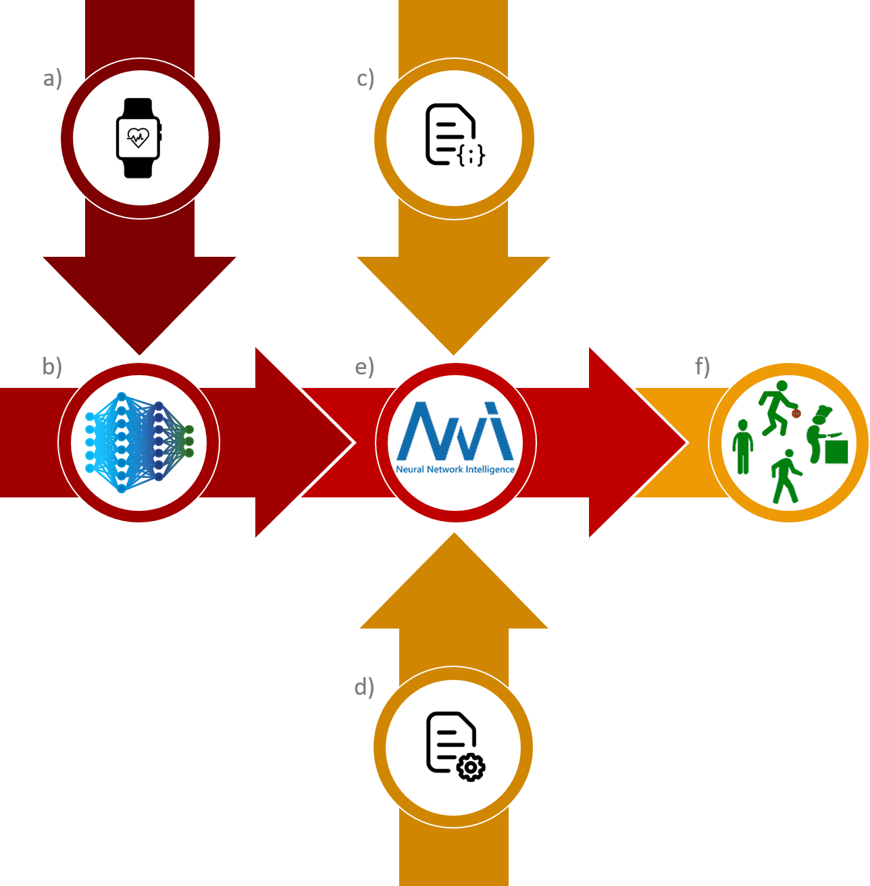

# <b>NeHAR</b>
### <b>Neuromorphic Human Activity Recognition</b>
<br>

With this project, we propose a viable pipeline for application-aware optimization of both spiking and non-spiking neural networks by means of the NNI toolkit ([NNI webpage](https://www.microsoft.com/en-us/research/project/neural-network-intelligence/), [NNI github repository](https://github.com/microsoft/nni)).<br>

First shown with focus on the human activity recognition (HAR) task in the paper <i>"Human activity recognition: suitability of a neuromorphic approach for on-edge AIoT applications"</i>, the procedure we present here is flexible to be tailored to different problems. Specifically, since we employed it for both convolutional and recurrent neural networks, its application domain can be extended to both time-dependent and time-independent tasks.<br>
<br>

The picture below schematically summarizes the different steps:<br>
<br>

<br>

As first step (<b>a</b>), being the proposed workflow an application-aware procedure, the dataset(s) of interest is/are identified. Based on such selection, the network architectures of interest are defined (<b>b</b>). Then, the NNI experiment is designed by means of a search space for the (hyper)parameters to be optimized (<b>c</b>) and of a configuration file with the details on how to perform the optimization (<b>d</b>). Once the experiment is fully defined, it can be run (<b>e</b>) resulting in an optimized classifier for the specific task of interest (<b>f</b>).<br>

In the following, practical information to reproduce all the steps are provided.<br><br>

## Reference

Vittorio Fra, Evelina Forno, Riccardo Pignari, Terrence Stewart, Enrico Macii, and Gianvito Urgese:  
Human activity recognition: suitability of a neuromorphic approach for on-edge AIoT applications. 
Neuromorphic Computing and Engineering 2022.

See article on [IOPScience](http://iopscience.iop.org/article/10.1088/2634-4386/ac4c38)

## Virtual environment configuration

To clone the project:
```
git clone https://github.com/neuromorphic-polito/NeHAR
```
To reproduce and activate the (conda) environment:
```
conda env create -f env_nni.yml
conda activate env
```
<br>


## Definition of the optimization experiment

To define and run an NNI optimization experiment, three different instruction files are needed:<br>
&emsp;&emsp; 1) ```.json``` file for the search space definition;<br>
&emsp;&emsp; 2) ```.yml``` file to specify the experiment execution details;<br>
&emsp;&emsp; 3) ```.py``` file to actually define the experiment to be run.<br>

The latter contains all the information about the network to be optimized: its structure, its training and then its evaluation are defined in this file. In the [experiments](./experiments) folder, the ```.py``` files for all the networks investigated within this project (namely `LSTM`, `CNN`, [`spiking CNN`](https://www.nengo.ai/nengo-dl/examples/keras-to-snn.html), [`LMU`](https://www.nengo.ai/nengo-dl/examples/lmu.html) and [`spiking LMU`](https://www.nengo.ai/nengo-loihi/v1.0.0/examples/lmu.html)) are available.<br>

In the ```.json``` file the characteristics of the search space to be explored during the optimization are instead defined. In more detail, here all the (hyper)parameters accounted for are listed by defining their range of values. The specific file for each of the above mentioned networks is available in the [searchspaces](./searchspaces) folder.<br>

Finally, the ```.yml``` file defines the configuration of the NNI experiment:<br>
&emsp;&emsp; - experiment duration;<br>
&emsp;&emsp; - number of trials to be performed;<br>
&emsp;&emsp; - tuner and optimization rule;<br>
&emsp;&emsp; - GPU usage (to be specified whether GPU is available or not);<br>
&emsp;&emsp; - paths of the ```.json``` and the ```.py``` files to be used.<br>
<br>


## Start the optimization experiment

In the configuration files, the command to run the proper ```.py``` file is defined.<br>
Before starting an NNI experiment, check if GPU can be used or not and set accordingly the ```gpuNum``` and ```gpuIndices``` settings in the ```.yml``` file. Then, to start the NNI optimization experiment, the following command has to be used:
```
nnictl create --config configurations/{NameOfTheYmlFile}
```
```.yml``` files available in the project:<br>
&emsp;&emsp; nni_cnn_lstm_trial.yml<br>
&emsp;&emsp; nni_lmu_trial.yml<br>
&emsp;&emsp; nni_scnn_trial.yml<br>
&emsp;&emsp; nni_slmu_trial.yml<br><br>

Note that, if the ```--port``` option is not specified, the default 8080 will be used.<br>

All the experiments will be saved in:
```
os.path.expanduser('~')/nni-experiments/
```
There, logs and results of each trial will be saved in relative path defined as:
```
{ExperimentID}/trials/{TrialID}
```
In the [output](./output) folder, the network weights (giving the best test results) will be instead saved following the path defined by the ```out_dir``` variable in the corresponding ```.py``` file.<br><br>


## Post-optimization analysis

The [post-optimization notebook](./post-optimization.ipynb) can be then employed to load the optimized (hyper)parameters obtained by the NNI experiments and obtain, for each network, the confusion matrix, the evaluation of the memory footprint and an assessment of energy consumption.<br>
In order to successfully do so, the <b>experiment ID</b> and the <b>trial ID</b> of the best results from the NNI optimization must be used, as it is explained at the beginnning of the notebook itself.
